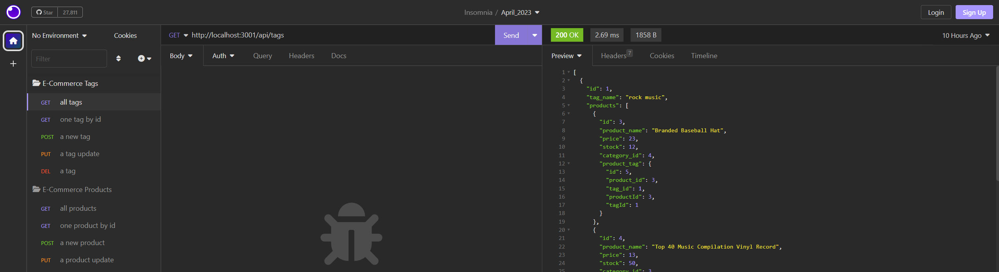
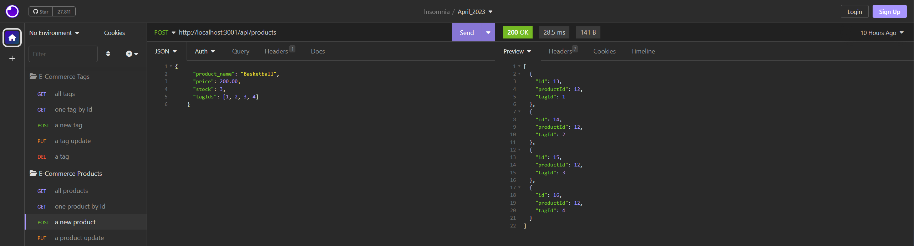

# e-commerce-back-end

## Description

The [e-commerce back end](https://github.com/CollyLee/e-commerce-back-end) project simulates the back-end database of an online store. Using different routes with Express, and MySQL/Sequelize for the database functions, the application can create/adjust/delete categories, tags, and products that you would find in an online marketplace. Because the application pushes and stores these in a JSON file, there is persistent data between sessions.

## Installation

No installation is needed for this application. All that is needed is NodeJS to start the server, and a tool that allows you to test APIs (such as Insomnia).

## Usage

A full video walkthrough of using the application can be found [here](https://drive.google.com/file/d/1EL3ITS-qn1ZF3Lu1eMixoRXonqsQYtTr/view).

From the root folder, you will need to create the ecommerce_db if you don't have it already. That can be done with the schema file in db. Next, seed the database with Node using the index.js file in the seeds folder. Finally, start the server with node, and you can then test the API channels in Insomnia.

Using the URL paths found in the routes folder, you can perform Get (get all or get one by id), Post (create a new), Put (edit an existing), and Delete commands on all three types of objects in the database. To add or edit any existing object, provide the desired specifications in JSON format.

When an action is performed, you will receive a JSON confirmation in the preview section of Insomnia, and a preview of the created item if you followed a Post route.
